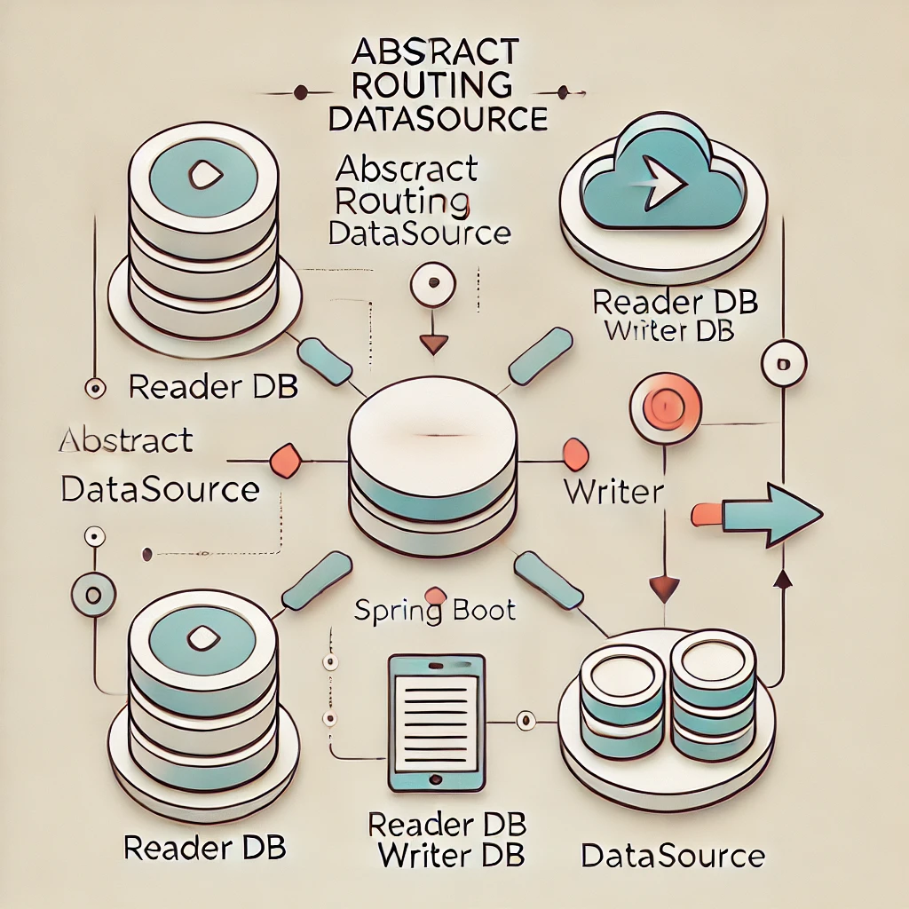

### Overview
`AbstractRoutingDataSource` in Spring Boot allows for efficient dynamic routing between multiple data sources, such as separating read and write requests between Reader and Writer databases. This setup is particularly useful for applications with high read traffic, as it helps distribute the load and improve performance. In this post, we’ll explore how to configure `AbstractRoutingDataSource` to route transactions dynamically based on read-only or write operations.

---

### 1. What is `AbstractRoutingDataSource`?
`AbstractRoutingDataSource` is a Spring feature that allows routing to different data sources at runtime. By extending this class, we can override the `determineCurrentLookupKey` method to define custom logic for choosing the target data source. This approach is particularly beneficial for directing read-only queries to a Reader and write queries to a Writer in a distributed database environment.

---

### 2. Setting up Reader and Writer DataSources

In this example, we’ll configure separate data sources for Reader and Writer databases. First, we define configurations for each data source.

#### Reader DataSource Configuration
```java
@Configuration
public class ReaderDataSourceConfig {

    @Bean
    @ConfigurationProperties(prefix = "spring.datasource.reader")
    public DataSource readerDataSource() {
        return DataSourceBuilder.create().build();
    }
}
```

#### Writer DataSource Configuration
```java
@Configuration
public class WriterDataSourceConfig {

    @Bean
    @ConfigurationProperties(prefix = "spring.datasource.writer")
    public DataSource writerDataSource() {
        return DataSourceBuilder.create().build();
    }
}
```

These configurations should be linked to specific properties in your `application.yml`:

```yaml
spring:
  datasource:
    reader:
      url: jdbc:mysql://reader-db:3306/mydb
      username: reader_user
      password: reader_password
    writer:
      url: jdbc:mysql://writer-db:3306/mydb
      username: writer_user
      password: writer_password
```

---

### 3. Implementing `AbstractRoutingDataSource`

Now, we’ll create a custom class that extends `AbstractRoutingDataSource`. This class will determine whether to route the request to the Reader or Writer data source based on the transaction’s read-only attribute.

```java
public class RoutingDataSource extends AbstractRoutingDataSource {

    @Override
    protected Object determineCurrentLookupKey() {
        return TransactionSynchronizationManager.isCurrentTransactionReadOnly() ? "reader" : "writer";
    }
}
```

In this example, `determineCurrentLookupKey` checks if the current transaction is read-only. If true, it routes to the Reader; otherwise, it routes to the Writer.

---

### 4. Configuring Routing DataSource

Next, configure `RoutingDataSource` as the main data source. This will dynamically route requests based on transaction type.

```java
@Configuration
public class DataSourceConfig {

    @Bean
    public DataSource dataSource() {
        RoutingDataSource routingDataSource = new RoutingDataSource();

        Map<Object, Object> dataSourceMap = new HashMap<>();
        dataSourceMap.put("reader", readerDataSource());
        dataSourceMap.put("writer", writerDataSource());

        routingDataSource.setTargetDataSources(dataSourceMap);
        routingDataSource.setDefaultTargetDataSource(writerDataSource());

        return routingDataSource;
    }

    @Bean
    public DataSource readerDataSource() {
        return DataSourceBuilder.create().build();
    }

    @Bean
    public DataSource writerDataSource() {
        return DataSourceBuilder.create().build();
    }
}
```

With this setup, the data source routes based on transaction properties without manually specifying each transaction’s data source.

---

### 5. Using the DataSources in Service Layer

Here’s a simple example of a service that uses different data sources based on the transaction type.

#### UserService Implementation

```java
@Service
public class UserServiceImpl implements UserService {

    private final UserRepository userRepository;

    public UserServiceImpl(UserRepository userRepository) {
        this.userRepository = userRepository;
    }

    // Read-only transaction routed to Reader
    @Override
    @Transactional(readOnly = true)
    public User getUserById(Long id) {
        return userRepository.findById(id)
                .orElseThrow(() -> new RuntimeException("User not found"));
    }

    // Write transaction routed to Writer
    @Override
    @Transactional
    public User createUser(User user) {
        return userRepository.save(user);
    }
}
```

The `@Transactional(readOnly = true)` annotation triggers the `readerDataSource`, while the standard `@Transactional` routes to the `writerDataSource`.

---

### 6. Simple Architecture Diagram

Below is a simple architecture diagram that shows how transactions are routed based on their type:



---

### Key Benefits of `AbstractRoutingDataSource`
- **Dynamic Routing**: Automatically routes read-only transactions to Reader and write transactions to Writer.
- **Improved Performance**: Offloads read operations to separate instances, distributing database load more effectively.
- **Simplicity**: Allows routing logic to be centralized, reducing code complexity in service layers.

---

### Conclusion
`AbstractRoutingDataSource` is an effective solution for managing multiple data sources in Spring Boot, especially when read and write operations need to be separated. This configuration optimizes database performance and makes handling multiple data sources in a distributed system much easier. Try integrating `AbstractRoutingDataSource` into your next project to see the performance improvements firsthand.

Thank you for reading! 👍
